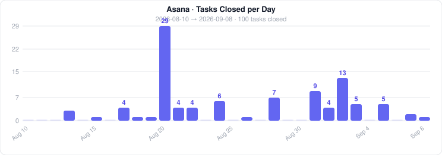

# Asana Task Chart

Generates a daily bar chart of closed Asana tasks and commits it to the repo nightly via GitHub Actions. Drop it into any GitHub profile README for a live productivity snapshot.

<!-- ASANA_STATS_START -->


_Updated Sun, 21 Jun 2026 10:31:59 GMT_
<!-- ASANA_STATS_END -->

## How it works

1. A scheduled GitHub Action runs nightly at midnight (configurable)
2. `scripts/fetch-asana-stats.js` queries the Asana search API for tasks assigned to you and completed in the last N days
3. Results are grouped by day and rendered as an SVG bar chart
4. The chart is committed back to `assets/asana-chart.svg`
5. Any README that references the raw URL of that file updates automatically

## Setup

**1. Find your Asana IDs** (run once locally):
```bash
ASANA_PAT=your_token node scripts/get-asana-ids.js
```
Prints your user GID and workspace GID.

**2. Add GitHub repository secrets** (Settings → Secrets and variables → Actions):

| Secret | Value |
|--------|-------|
| `ASANA_PAT` | Personal Access Token from [asana.com/0/my-apps](https://app.asana.com/0/my-apps) |
| `ASANA_WORKSPACE_GID` | Numeric workspace ID from the helper script |
| `ASANA_USER_GID` | *(Optional)* Numeric user ID — defaults to `me` |

**3. Trigger the first run manually:**
Actions → "Update Asana Task Stats" → Run workflow

## Configuration

| Variable | Default | Description |
|----------|---------|-------------|
| `DAYS` | `30` | Number of past days to include in the chart |
| cron schedule | `0 7 * * *` | When the Action runs (UTC) |

Both are set in [`.github/workflows/update-asana-stats.yml`](.github/workflows/update-asana-stats.yml).

## Embed in your profile README

```markdown

```
